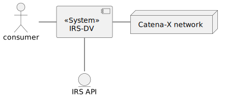
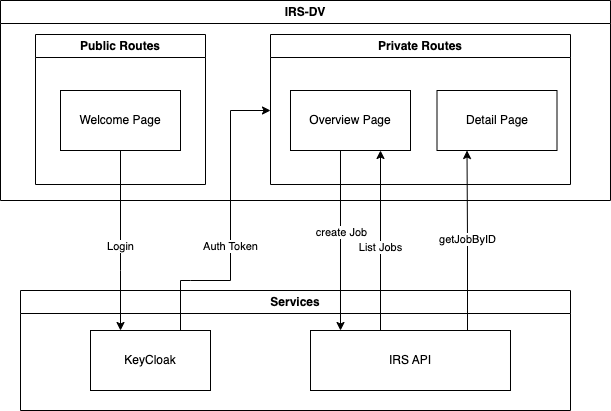
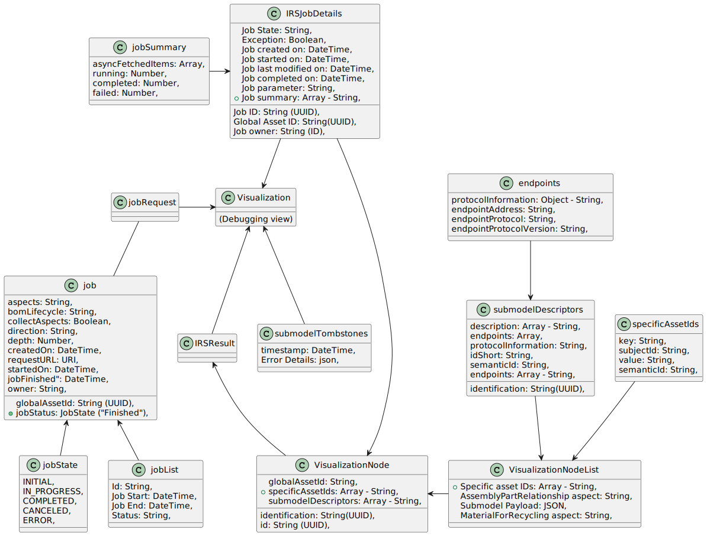
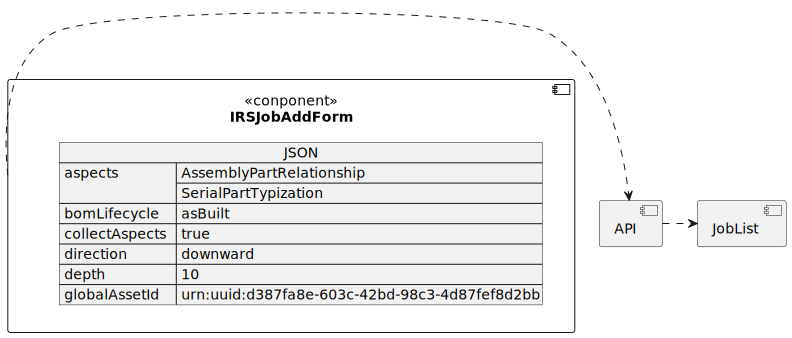

# Architecture documentation (arc42)

## Table of Contents

- [Architecture documentation (arc42)](#architecture-documentation-arc42)
  - [Table of Contents](#table-of-contents)
- [Introduction and goals](#introduction-and-goals)
  - [Requirements overview](#requirements-overview)
    - [What is the Item Relationship Service Debugging View?](#what-is-the-item-relationship-service-debugging-view)
    - [Key Features](#key-features)
  - [Quality goals](#quality-goals)
- [Architecture Constraints](#architecture-constraints)
  - [Technical Constraints](#technical-constraints)
  - [Organizational Constraints](#organizational-constraints)
  - [Political constraints](#political-constraints)
  - [Development conventions](#development-conventions)
  - [Code analysis, linting and code coverage](#code-analysis-linting-and-code-coverage)
- [System scope and context](#system-scope-and-context)
  - [Business context](#business-context)
    - [End User](#end-user)
    - [IRS Job API](#irs-job-api)
  - [Technical context](#technical-context)
  - [Component overview](#component-overview)
    - [IRS-API](#irs-api)
    - [IRS-Debugging View](#irs-debugging-view)
- [Solution strategy](#solution-strategy)
  - [Introduction](#introduction)
  - [Technology](#technology)
    - [Overview of the dependencies](#overview-of-the-dependencies)
    - [Dev Dependencies](#dev-dependencies)
    - [UI Components](#ui-components)
    - [Authentication](#authentication)
    - [Network Management](#network-management)
    - [Node Visualization](#node-visualization)
    - [I18n](#i18n)
    - [Routing](#routing)
    - [Other](#other)
  - [Structure](#structure)
- [Building block view](#building-block-view)
  - [Whitebox overall system](#whitebox-overall-system)
    - [Component diagram](#component-diagram)
    - [Component description](#component-description)
  - [IRS API](#irs-api-1)
    - [References](#references)
- [Deployment view](#deployment-view)
  - [Local deployment](#local-deployment)
  - [View Levels](#view-levels)
  - [Level 0 - Cluster overview](#level-0---cluster-overview)
    - [Isolated environment](#isolated-environment)
    - [Integrated environment](#integrated-environment)
  - [Level 1 - IRS application](#level-1---irs-application)
- [Cross-cutting concepts](#cross-cutting-concepts)
  - [Domain concepts](#domain-concepts)
    - [Domain model](#domain-model)
    - [JobStatus](#jobstatus)
    - [Job Response Datamodel](#job-response-datamodel)
  - [Safety and security concepts](#safety-and-security-concepts)
    - [Authentication / Authorization](#authentication--authorization)
    - [IRS API](#irs-api-2)
  - [Credentials](#credentials)
  - ["Under-the-hood" concepts](#under-the-hood-concepts)
    - [Exception and error handling](#exception-and-error-handling)
    - [Technical errors](#technical-errors)
    - [Routing errors](#routing-errors)
    - [Authentication errors](#authentication-errors)
  - [Development concepts](#development-concepts)
    - [Build, test, deploy](#build-test-deploy)
    - [Dependencies Upgrade Strategy](#dependencies-upgrade-strategy)
      - [NOTE](#note)
  - [Operational concepts](#operational-concepts)
    - [Configuration - Helm Chart](#configuration---helm-chart)
- [Quality requirements](#quality-requirements)
  - [List of requirements](#list-of-requirements)
- [Glossary](#glossary)

---

---

# Introduction and goals

This chapter gives you an overview about the goals of the service, in which context the service runs and which stakeholders are involved.

## Requirements overview

### What is the Item Relationship Service Debugging View?

The Item Relationship Service Debugging View (IRS-DV) is a web-based tool that allows you to inspect IRS jobs to identify errors and faults. It leverages an API endpoint to retrieve and display the tree structures of data assets in a recursive manner across the Catena-X network.
Moreover, the IRS-DV serves as a reference implementation and a prototype, providing a foundation for the development of other applications.

### Key Features

- Displays a top-down BoM tree structure based on the "AssemblyPartRelationship" submodel.
- Utilizes the IRS Jobs endpoint to interact with the Catena-X network.

## Quality goals

The following table entries define overall IRS-DV quality goals. The order of the topics do not resolve in a priority of the quality goals.

| Quality Objective               | Reasoning and Explanation                                                                                                                                                                                                |
| ------------------------------- | ------------------------------------------------------------------------------------------------------------------------------------------------------------------------------------------------------------------------ |
| Robust Reference Implementation | The IRS-DV is designed to visualize completed IRS Jobs. The focus of the IRS-DV release is to build a functional solution that can display a job as a tree of nodes, with emphasis on identifying any failing nodes.     |
| Cloud-Neutral Design            | The IRS-DV is intended to serve as a reference architecture and be compatible with various cloud solutions. It utilizes helm charts, terraform, and abstracts storage to enable easy integration with different systems. |
| Adequate Security Measures      | The IRS-DV is equipped with a basic set of security features and requires users to log in through Keycloak to access the program.                                                                                        |
|                                 |

<br>
<br>

[Back to top](#)

<br>
<br>

# Architecture Constraints

## Technical Constraints

| Constraint                                         | Explanation                                                                                                                                                                                                                            |
| -------------------------------------------------- | -------------------------------------------------------------------------------------------------------------------------------------------------------------------------------------------------------------------------------------- |
| Cloud-Neutral Design Approach                      | The IRS provides a reference implementation that can be deployed on any cloud platform, avoiding vendor lock-in to a specific cloud provider.                                                                                          |
| Adoption of Kubernetes for Container Orchestration | The IRS utilizes Kubernetes for container orchestration, software deployment, scaling, and management. This supports the software infrastructure and enables effective management and scalability of the IRS reference implementation. |

## Organizational Constraints

| Name             | Description                                                               | Comment                                                         |
| ---------------- | ------------------------------------------------------------------------- | --------------------------------------------------------------- |
| IRS Jobs Service | The IRS is provided as a shared data service within the Catena-X network. | Multiple IRS job services can be configured as target services. |
| Keycloak         | Authentication for the IRS is handled through a Keycloak instance.        |                                                                 |

## Political constraints

| Name                | Description                                                                                                                                                                                       |
| ------------------- | ------------------------------------------------------------------------------------------------------------------------------------------------------------------------------------------------- |
| Open Source Usage   | The use of Free and Open-Source Software (FOSS) licenses approved by the Eclipse Foundation is mandatory. This ensures that the content contributions are regulated under approved FOSS licenses. |
| Apache License 2.0  | The Apache License 2.0 must be used to respect and protect intellectual property (IP).                                                                                                            |
| Node.js Requirement | The IRS application must be developed using Node.js, an open-source, cross-platform JavaScript runtime environment and library for running web applications outside the client's browser.         |

                                                    |

## Development conventions

| Name                                     | Description                                                                                                                                                                                                              |
| ---------------------------------------- | ------------------------------------------------------------------------------------------------------------------------------------------------------------------------------------------------------------------------ |
| Architecture documentation               | The IRS-DV has architectural documentation based on the ARC42 template, providing a clear and organized understanding of the system's design.                                                                            |
| Coding guidelines                        | The code follows recommended TypeScript format as outlined by ESlint to ensure consistency and maintainability.                                                                                                          |
|                                          |
| Module structure                         | The IRS-DV uses a React single page application structure.                                                                                                                                                               |
| Code analysis, linting and code coverage | To maintain the quality and consistency of the code base, code analysis, linting and code coverage are performed. This helps enforce coding standards and prevents the merging of code that does not meet the standards. |

## Code analysis, linting and code coverage

| Tool       | Scope                                                           | Rule                                                              | Configuration (via files / annotations)  |
| ---------- | --------------------------------------------------------------- | ----------------------------------------------------------------- | ---------------------------------------- |
| Vitest     | Test coverage and ensuring build quality                        | Builds will fail if coverage is below 80%                         | vite.config.ts                           |
| Dependabot | Automated dependency management via pull requests within GitHub | All dependency updates will automatically generate pull requests. | .github/dependabot.yml                   |
| Prettier   | Code formatting                                                 | Standardizes code style for all developers                        | .prettierrc.json                         |
| ESLINT     | Identifying and fixing problems in JavaScript code              | Ensures consistent coding practices and rules                     | .github/.eslintrc                        |
| SonaCloud  | Code quality and security scanning                              | Configured for use across the Catena-X community                  |
| Veracode   | Package and security scanning                                   | Global Catena-X configuration.                                    | https://web.analysiscenter.veracode.com/ |

<br>
<br>

[Back to top](#)

<br>
<br>

# System scope and context

The IRS-DV is as a viewer of IRS Jobs. This section describes the environment of IRS-DV. Who are its users, and with which other systems does it interact with.

## Business context

### End User

The end user wants to debug a data chain of an IRS-job, either ongoing or completed. 

### IRS Job API

The IRS-DV retrieves data from the IRS Job API. This connection is mandatory. If the Catena-X services are unavailable, the IRS-DV cannot display any data.

## Technical context



==TODO: IRS-DV - IRS - CX Network==

## Component overview

### IRS-API

We use a REST API that is made by IRS team and can be used by any system registered in the Catena-X Keycloak. For communication we use HTTP(S) protocol.

### IRS-Debugging View

The IRS-DV system is used to list all current and running jobs. It can create new jobs by defining the globalAssetId-parameter and other parameters. In addition, the system presents detailed information on individual jobs in a tree-node structure, making it easy to navigate and locate specific data.

<br>
<br>

[Back to top](#)

<br>
<br>

# Solution strategy

## Introduction

| Quality goal                  | Matching approaches in the solution                                                                                                                             |
| ----------------------------- | --------------------------------------------------------------------------------------------------------------------------------------------------------------- |
| application reliability       | <ul><li>data is fetched from IRS API</li><li>IRS-DV can be hosted decentralized by every participant by being an open source reference implementation</li></ul> |
| base security measures        | <ul><li>automatic static and dynamic code analysis tools as part of the pipeline</li></ul>                                                                      |
| cloud agnostic solution       | <ul><li>IRS-DV is provided as a Docker image</li><li>Helm charts assist in deploying the application in any Kubernetes environment</li></ul>                    |
| running reference application | <ul><li>Working application can be used as reference by anyone due to open source publishing </li></ul>                                                         |

## Technology

The IRS-DV system was developed using the React framework, chosen for its widespread support and the team's technical expertise.

The application is hosted using Docker and Kubernetes, which are widely used and compatible with multiple hosting providers, such as AWS, Google Cloud, and Azure.

React-Query was used to make the REST Api provided by the IRS-Jobs easy to integrate.


### Overview of the dependencies

### Dev Dependencies

Build system Vite (https://vitejs.dev/)
Testing: ViTest (https://vitest.dev/) + Testing Library (https://testing-library.com/)

### UI Components
The look and feel of the application is defined by the *Catena-X Components*
```js
    "cx-portal-shared-components": "0.10.0", 
```
Documentation: https://portal.dev.demo.catena-x.net/_storybook/?path=/story/chip--examples

**Supporting Libraries**
```js
    "@emotion/react": "^11.10.5",
    "@emotion/styled": "^11.10.5",
    "@mui/icons-material": "^5.11.0",
    "@mui/material": "5.11.6",
    "@mui/x-data-grid": "^5.17.21",
```
These libraries were chosen to be consistent with other CatenaX projects.

### Authentication
For authentication in addition to the base keycloak-js, the react wrapper is needed to provide a simple method to define public and private routes.
```js
"@react-keycloak/web": "^3.4.0",
"keycloak-js": "^20.0.3",
```

Documentation: https://www.keycloak.org/docs/latest/securing_apps/index.html#_javascript_adapter

This library was chosen to be consistent with other CatenaX projects.

### Network Management
```js
"@tanstack/react-query": "^4.23.0",
```
https://tanstack.com/query/latest/docs/react/overview

This library was chosen to ensure network management.

### Node Visualization
```js
"reactflow": "^11.5.1"
"dagre": "^0.8.5", (needed to layout the nodes)
```
https://reactflow.dev/

This library was chosen as it has several features to ensure that large datasets can be rendered as well. It is easy to extend, and customize the individual nodes in the graph.
Multiple node layout engines can be used as well. We are currently using the 'dagre' - library as suggested by the reactflow documentation.

### I18n
```js
"i18next": "^22.4.9",
"i18next-browser-languagedetector": "^7.0.1",
"react-i18next": "^12.1.4",
```
This library was chosen to be consistent with other CatenaX projects.

### Routing
```js
"react-router-dom": "^6.8.0",
```
More Info: https://reactrouter.com/en/main

This library was chosen to be consistent with other CatenaX projects.

### Other
```js
"dayjs": "^1.11.7",
"lodash": "^4.17.21",
"react-hook-form": "^7.42.1",
"react-syntax-highlighter": "^15.5.0",
```

## Structure

The IRS-DV has three primary views, which include:

1. The welcome page that enables users to select the active environment and authenticate.
2. The overview page that allows users to create or list jobs.
3. The job detail page that features a tree visualization and tombstone blocks.


<br>
<br>

[Back to top](#)

<br>
<br>

# Building block view

## Whitebox overall system

The interfaces show how the components interact with each other and which interfaces the IRS-DV are.

Full backend services graph you can find at **[IRS team](https://catenax-ng.github.io/tx-item-relationship-service/docs/arc42/full.html#_whitebox_overall_system)**.

### Component diagram




### Component description

| Components          | Description                                                                                      |
| ------------------- | ------------------------------------------------------------------------------------------------ |
| **Welcome Page**    |                                                                                                  |
| IRSSelectServerEnv  | Select server environmental between given servers                                                |
| **Overview Page**   |                                                                                                  |
| IRSJobAddForm       | In this component, you can select settings according to which globalAssetId you are looking for. |
| IRSJobOverview      | IRS-DV history by search parameters                                                              |
| **Detail Page**     |                                                                                                  |
| IRSJobVisualization | IRS-DV visualization based on search parameters. We show all related nodes.                      |
| IRSJobTombstones    | IRS-DV cached errors                                                                             |
| **Other**           |                                                                                                  |
| ErrorPage           | Catch errors(router error and ... ) and show error page                                          |


## IRS API

### References

The Swagger documentation can be found in the local deployment of the reference application. More information can be found in the GitHub repository: https://github.com/eclipse-tractusx/item-relationship-service/blob/main/README.md

<br>
<br>

[Back to top](#)

<br>
<br>


# Deployment view

The deployment view shows the IRS-DV application

```
//TODO: Adjust after HelmCarts Need later overview
```

**GitHub**

GitHub contains the application source code as well as the Helm charts used for deployment. The IRS Helm charts can be found here: https://github.com/eclipse-tractusx/item-relationship-service/tree/main/charts

## Local deployment

For information on how to run the application locally, please check the README documentation in GitHub: https://github.com/catenax-ng/product-item-relationship-service-frontend

## View Levels

## Level 0 - Cluster overview

### Isolated environment

The isolated environment contains the IRS-DV as well as the surrounding services, excluding the external Keycloak.

isolated (IMAGE)

==TODO: Image?==

### Integrated environment

The integrated environment contains the IRS and is integrated with the rest of the Catena-X network.

integrated (IMAGE)

==TODO: Image?==

## Level 1 - IRS application

This section focuses only on the IRS-DV itself, detached from its neighbors. It shows the resources deployed in Kubernetes for the IRS.

irs resources (IMAGE)

==TODO: Image?==
**Pod**

This is the actual IRS Docker image which runs as a container. The ports are only available internally and can be opened up with the Service.

<br>
<br>

[Back to top](#)

<br>
<br>

# Cross-cutting concepts

## Domain concepts

### Domain model



### JobStatus

A job can be in one of the following states:

| State     | Description                                                                     |
| --------- | ------------------------------------------------------------------------------- |
| INITIAL   | The job was stored by the system and is now queued for processing.              |
| RUNNING   | The job is currently being processed.                                           |
| COMPLETED | The job has completed. See the job response for details on the data.            |
| CANCELED  | The job could not be processed, user canceled request                           |
| ERROR     | The job could not be processed correctly by the IRS due to a technical problem. |

### Job Response Datamodel



## Safety and security concepts

### Authentication / Authorization

### IRS API


The IRS-DV accesses the IRS API by using RESTful calls over HTTP(S). Authentication is handled by Keycloak. 

## Credentials

Credentials must never be stored in Git!

## "Under-the-hood" concepts

### Exception and error handling

There are two types of potential errors in the IRS-DV:

### Technical errors

Technical errors occur when there is a problem with the API itself. The errors are handled by react-query and the user receives a visual error message.

### Routing errors

Since the application is using react-router, it is possible to manually navigate to routes that are invalid. In this case, a seperate "Error Page" is used to display the routing error message.

### Authentication errors
If an authentication error is encoutered, the previous token is invaidated and user is automatically redirected to the welcome page.


## Development concepts

### Build, test, deploy

The IRS-DV is built using React and utilizes all the standard concepts of it. Test execution is part of the build process and a minimum test coverage of 80% is enforced.

==TODO: Still open - add info about helm chart==

Although the Docker image can be deployed in various ways, the standard solution are the provided Helm charts, which describe the required components as well.

### Dependencies Upgrade Strategy
Currently there is no fixed schedule to upgrade the packages. 

#### NOTE
Currently the package: "@mui/material": "5.10.17" cannot be updated to a newer version.
A ticket has been opened with the owner of the library https://github.com/mui/material-ui/issues/35773


## Operational concepts

### Configuration - Helm Chart

The most relevant config properties are exposed as environment variables and must be set in the Helm chart so the application can run at all. Check the IRS Helm chart in Git for all available variables.

==TODO: Add Link to documentation==

  <br>
  <br>

[Back to top](#)

<br>
<br>

# Quality requirements

The quality scenarios in this section depict the fundamental quality goals as well as other required quality properties. They allow the evaluation of decision alternatives.

- Quality attribute: A characteristic of software, or a generic term applying to quality factors, quality subfactors, or metric values.

- Quality factor: A management-oriented attribute of software that contributes to its quality.

- Quality subfactor: A decomposition of a quality factor or quality subfactor to its technical components.

- Metric value: A metric output or an element that is from the range of a metric.

- Software quality metric: A function whose inputs are software data and whose output is a single numerical value that can be interpreted as the degree to which software possesses a given attribute that affects its quality.

**Source**: IEEE standard 1061 “Standard for a Software Quality Metrics Methodology”

## List of requirements

We are not going to list the requirements here, as they are defined in the configuration files of various tools:

* Prettier - ensures that the code is formatted consistently
* ESLint - Ensures that the code follows consistent code conventions
* Vitest - Is used to test and generate a code coverage report
* Sonarcube - evaluates and provides a metric of the current state of the code quality. (This is centrally configured and defined)

<br>
<br>

[Back to top](#)

<br>
<br>

# Glossary

| Term                                | Description                                                                                                                                                                                                                                                                          |
| ----------------------------------- | ------------------------------------------------------------------------------------------------------------------------------------------------------------------------------------------------------------------------------------------------------------------------------------ |
| IRS                                 | Item Relationship Service                                                                                                                                                                                                                                                            |
| IRS-DV                              | Item Relationship service Debugging view                                                                                                                                                                                                                                             |

<br>
<br>

[Back to top](#)

<br>
<br>
